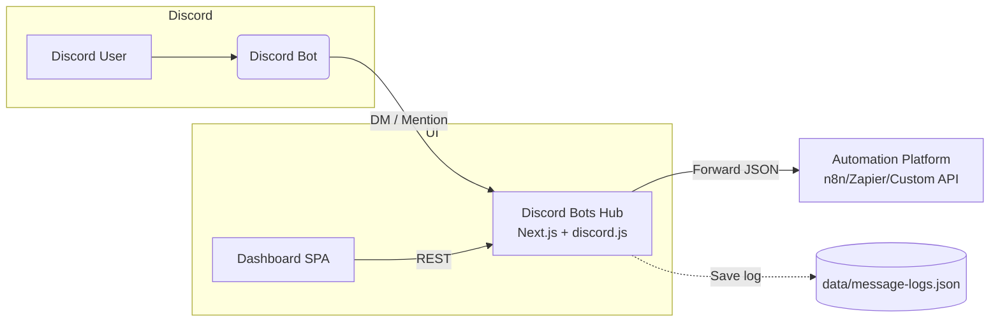

<div align="center">
  <h1>Discord Bots Hub</h1>
  <p>
    An open-source, self-hosted dashboard to manage multiple <strong>Discord bots</strong>, monitor their status in real time and <strong>forward every DM or mention to any webhook</strong> – n8n, Zapier, custom APIs and more.
  </p>
</div>

---

## Table of contents

1. [Why Discord Bots Hub?](#why-discord-bots-hub)
2. [Key features](#key-features)
3. [Architecture at a glance](#architecture-at-a-glance)
4. [Getting started](#getting-started)
5. [Discord configuration guide](#discord-configuration-guide)
6. [Webhook payload reference](#webhook-payload-reference)
7. [Roadmap & ideas](#roadmap--ideas)
8. [Contributing](#contributing)
9. [License](#license)

---

## Why Discord Bots Hub?

Managing more than one Discord bot quickly becomes painful:

- Tokens are scattered across spreadsheets.
- You need to keep bots online and confirm they are listening to DMs.
- Forwarding conversations to automation tools requires custom glue code.

**Discord Bots Hub** provides a single pane of glass for teams that build automations on top of Discord. It keeps bots online, logs every incoming message (DMs or mentions) and forwards them to a webhook of your choice. The project is written with **Next.js 16**, **TypeScript**, **pnpm** and **discord.js 14**, and it is ready to self-host on any Node.js-compatible platform.

---

## Key features

| Capability | Description |
|------------|-------------|
| **Multi-bot registry** | Store name, avatar, description, guild, webhook and encrypted tokens for as many bots as you need. |
| **Encrypted secrets** | Tokens are encrypted at rest using AES-256-GCM with a secret derived from `AUTH_SECRET`. |
| **Always-on status panel** | Inspect the status of each bot (online/offline/error) and start/stop/restart directly from the dashboard. |
| **Webhook bridge** | Every DM or mention that reaches the bot is forwarded to the configured webhook with rich context headers. |
| **DM + mentions capture** | Supports direct messages, guild channel mentions, attachments and message content (Message Content Intent required). |
| **Internationalised UI** | English, Español and Português-BR ready out of the box with runtime language switcher. |
| **Audit-friendly logs** | All inbound messages are appended to `data/message-logs.json` for later inspection. |
| **n8n-friendly** | Compatible with any webhook consumer, including n8n, Zapier, Make/Integromat, custom apps, serverless functions etc. |

---

## Architecture at a glance



- **discord.js** clients run server-side (Node.js runtime) to keep bots connected.
- The dashboard is rendered by Next.js, with client components for the bot list and status controls.
- Message logs are stored locally in the `data` directory (mountable volume when deploying).

---

## Getting started

### Requirements

- Node.js 20+
- pnpm 8+
- Discord application with bot tokens and required privileged intents enabled

### 1. Clone & install

```bash
git clone https://github.com/<your-org>/discord-bots-management.git
cd discord-bots-management
pnpm install
```

### 2. Configure environment variables

Copy the template and adjust the values:

```bash
cp env.example .env.local
```

| Variable | Required | Description |
|----------|----------|-------------|
| `AUTH_USERNAME` / `AUTH_PASSWORD` | ✅ | Credentials used to access the dashboard. |
| `AUTH_SECRET` | ✅ | **32+ characters** secret used to sign sessions and encrypt tokens. |
| `APP_BASE_URL` | ✅ | Public URL of the dashboard (used in emails and relay hints). |
| `DISCORD_PUBLIC_KEY` | ⬜ | Optional. Required only if you plan to validate slash-command signatures. |

### 3. Run locally

```bash
pnpm dev
# visit http://localhost:3000 and authenticate with the configured credentials
```

### 4. Production build

```bash
pnpm build
pnpm start
```

Deploy anywhere you can run Node.js 20 (Railway, Render, Fly.io, Docker, etc.). Persist the `data` directory to keep message logs and avatars.

---

## Discord configuration guide

1. **Enable privileged intents**  
   Visit the [Discord Developer Portal](https://discord.com/developers/applications) → *Bot* → *Privileged Gateway Intents* and enable:
   - `MESSAGE CONTENT INTENT`
   - `SERVER MEMBERS INTENT`

2. **Invite the bot to your guild**  
   Use OAuth2 → URL Generator with the `bot` scope and at least the following permissions: `Read Messages/View Channels`, `Send Messages`, `Read Message History`.

3. **Keep tokens private**  
   Generate a token, paste it into the dashboard when creating a bot. Tokens are stored encrypted; rotate them periodically.

4. **Do not run the same bot token in multiple apps**  
   Discord sends gateway events to a single connection. Stop other applications before testing with Discord Bots Hub.

5. **Test DM capture**  
   Use the “Send test DM” action (POST `/api/bots/:id/test-dm`) to confirm the bot can deliver a message to you, then reply and check the logs/webhook.

---

## Webhook payload reference

When a message is received, the hub posts the following JSON body to the configured webhook:

```json
{
  "botId": "e5d2a698-8e20-459a-99d3-428f0786dc5a",
  "botName": "Support Bot",
  "interactionOrigin": "hybrid",
  "guildId": "874347896852611155",
  "channelId": "1423687554938568866",
  "userId": "545339090804146207",
  "username": "lucianonmoreira",
  "messageId": "1437793100885135481",
  "content": "Preciso de ajuda!",
  "attachments": [],
  "createdAt": "2025-11-11T13:16:28.155Z"
}
```

Additional HTTP headers:

| Header | Description |
|--------|-------------|
| `X-Discord-Bot-Id` | ID of the bot that received the message. |
| `X-Discord-Guild-Id` | Guild ID or empty string for DMs. |
| `X-Discord-Channel-Id` | Channel ID (DM or guild). |
| `X-Discord-User-Id` | Author’s Discord user ID. |
| `X-Discord-Forwarded-By` | Always `discord-bots-management` (helpful when chaining webhooks). |

---

## Roadmap & ideas

- ✅ Capture DMs, guild mentions and attachments.
- ⏳ Native support for slash command interactions.
- ⏳ Built-in analytics dashboards (message volume per bot).
- ⏳ Webhook retry/backoff strategy with dead letter queue.
- 💡 Have a suggestion? [Open an issue](https://github.com/<your-org>/discord-bots-management/issues).

---

## Contributing

We welcome pull requests! Please read [`CONTRIBUTING.md`](CONTRIBUTING.md) for details on our code style, branching strategy and development workflow. By participating in this project you agree to abide by our [`CODE_OF_CONDUCT.md`](CODE_OF_CONDUCT.md).

### Quick contribution checklist

- Fork the repository and create a feature branch.
- Run `pnpm lint` and `pnpm test` (when available) before submitting.
- Provide screenshots or recordings for UI changes.
- Update documentation when behaviour changes.

---

## License

Discord Bots Hub is released under the [MIT License](LICENSE).

If you ship something with it, let us know on Twitter/X or open a showcase issue — we love to see creative automations built on top of Discord!

---

Happy automating! 🚀

